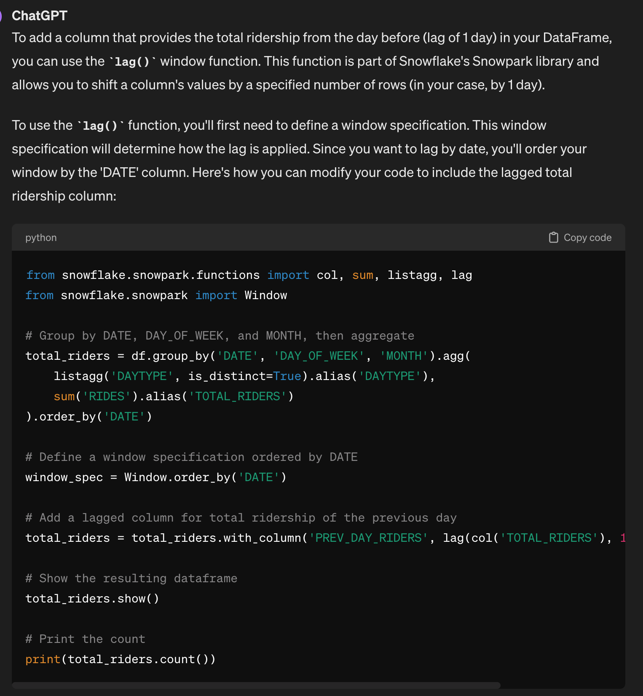

# Snowpark Intro Notebook - ML Forecasting
This notebook introduces several key features of Snowpark in the process of training a machine learning model for forecasting Chicago bus ridership.


* Establish secure connection to Snowflake
* Load features and target from Snowflake table into Snowpark DataFrame
* Prepare features for model training
* Train ML model using Snowpark ML distributed processing
* Save the model to the Snowflake Model Registry
* Run model predictions inside Snowflake

This notebook is intended to highlight Snowflake functionality and should not be taken as a best practice for time series forecasting. 

[Get Notebook](https://github.com/rajshah4/snowflake-notebooks/blob/main/Forecasting_ChicagoBus/Snowpark_Forecasting_Bus.ipynb)  

[Go to folder with dataset](https://github.com/rajshah4/snowflake-notebooks/blob/main/Forecasting_ChicagoBus/)  

[See more snowflake notebooks from raj](https://github.com/rajshah4/snowflake-notebooks/)

## 1. Setup Environment


```python
# Snowflake connector
from snowflake import connector
#from snowflake.ml.utils import connection_params

# Snowpark for Python
from snowflake.snowpark.session import Session
from snowflake.snowpark.types import Variant
from snowflake.snowpark.version import VERSION
from snowflake.snowpark import functions as F
from snowflake.snowpark.types import *

# Snowpark ML
from snowflake.ml.modeling.compose import ColumnTransformer
from snowflake.ml.modeling.pipeline import Pipeline
from snowflake.ml.modeling.preprocessing import StandardScaler, OrdinalEncoder
from snowflake.ml.modeling.impute import SimpleImputer
from snowflake.ml.modeling.model_selection import GridSearchCV
from snowflake.ml.modeling.xgboost import XGBRegressor
from snowflake.ml import version
mlversion = version.VERSION


# Misc
import pandas as pd
import json
import logging 
logger = logging.getLogger("snowflake.snowpark.session")
logger.setLevel(logging.ERROR)

```

## Establish Secure Connection to Snowflake

Using the Snowpark Python API, it’s quick and easy to establish a secure connection between Snowflake and Notebook. I prefer using a `toml` configuration file [as documented here](https://docs.snowflake.com/en/developer-guide/snowflake-python-api/snowflake-python-connecting-snowflake).
 *Note: Other connection options include Username/Password, MFA, OAuth, Okta, SSO*

The creds.json should look like this:
```
{
    "account": "awb99999",
    "user": "your_user_name",
    "password": "your_password",
    "warehouse": "your_warehouse"
  }


```python
with open('../../creds.json') as f:
    data = json.load(f)
    USERNAME = data['user']
    PASSWORD = data['password']
    SF_ACCOUNT = data['account']
    SF_WH = data['warehouse']

CONNECTION_PARAMETERS = {
   "account": SF_ACCOUNT,
   "user": USERNAME,
   "password": PASSWORD,
}

session = Session.builder.configs(CONNECTION_PARAMETERS).create()
```

Verify everything is connected. I like to do this to remind people to make sure they are using the latest versions.


```python
snowflake_environment = session.sql('select current_user(), current_version()').collect()
snowpark_version = VERSION

# Current Environment Details
print('User                        : {}'.format(snowflake_environment[0][0]))
print('Role                        : {}'.format(session.get_current_role()))
print('Database                    : {}'.format(session.get_current_database()))
print('Schema                      : {}'.format(session.get_current_schema()))
print('Warehouse                   : {}'.format(session.get_current_warehouse()))
print('Snowflake version           : {}'.format(snowflake_environment[0][1]))
print('Snowpark for Python version : {}.{}.{}'.format(snowpark_version[0],snowpark_version[1],snowpark_version[2]))
print('Snowflake ML version        : {}.{}.{}'.format(mlversion[0],mlversion[2],mlversion[4]))

```

    User                        : RSHAH
    Role                        : "RAJIV"
    Database                    : "RAJIV"
    Schema                      : "DOCAI"
    Warehouse                   : "RAJIV"
    Snowflake version           : 8.19.2
    Snowpark for Python version : 1.15.0a1
    Snowflake ML version        : 1.5.0


Throughout this notebook, I will change warehouse sizes. For this notebook warehouse size really doesn't matter much, but I want people to understand how easily and quickly you can change the warehouse size. This is one of my favorite features of Snowflake, just how its always ready for me.


```python
session.sql("create or replace warehouse snowpark_opt_wh with warehouse_size = 'SMALL'").collect()
session.sql("USE SCHEMA PUBLIC").collect()
```


    [Row(status='Statement executed successfully.')]


## 2. Load Data in Snowflake 

Let's get the data (900k rows) and also make the column names all upper cases. It's easier to work with columns names that aren't case sensitive.


```python
df_clean = pd.read_csv('CTA_Daily_Totals_by_Route.csv')
df_clean.columns = df_clean.columns.str.upper()
print (df_clean.shape)
print (df_clean.dtypes)
df_clean.head()
```

    (893603, 4)
    ROUTE      object
    DATE       object
    DAYTYPE    object
    RIDES       int64
    dtype: object


<div>
<style scoped>
    .dataframe tbody tr th:only-of-type {
        vertical-align: middle;
    }

    .dataframe tbody tr th {
        vertical-align: top;
    }

    .dataframe thead th {
        text-align: right;
    }
</style>
<table border="1" class="dataframe">
  <thead>
    <tr style="text-align: right;">
      <th></th>
      <th>ROUTE</th>
      <th>DATE</th>
      <th>DAYTYPE</th>
      <th>RIDES</th>
    </tr>
  </thead>
  <tbody>
    <tr>
      <th>0</th>
      <td>3</td>
      <td>01/01/2001</td>
      <td>U</td>
      <td>7354</td>
    </tr>
    <tr>
      <th>1</th>
      <td>4</td>
      <td>01/01/2001</td>
      <td>U</td>
      <td>9288</td>
    </tr>
    <tr>
      <th>2</th>
      <td>6</td>
      <td>01/01/2001</td>
      <td>U</td>
      <td>6048</td>
    </tr>
    <tr>
      <th>3</th>
      <td>8</td>
      <td>01/01/2001</td>
      <td>U</td>
      <td>6309</td>
    </tr>
    <tr>
      <th>4</th>
      <td>9</td>
      <td>01/01/2001</td>
      <td>U</td>
      <td>11207</td>
    </tr>
  </tbody>
</table>
</div>


Let's create a Snowpark dataframe and split the data for test/train. This operation is done inside Snowflake and not in your local environment. We will also save this as a table so we don't ever have to manually upload this dataset again.

PRO TIP -- Snowpark will inherit the schema of a pandas dataframe into Snowflake. Either change your schema before importing or after it has landed in snowflake. People that put models into production are very careful about data types.


```python
input_df = session.create_dataframe(df_clean)
schema = input_df.schema
print(schema)
```

    StructType([StructField('ROUTE', StringType(16777216), nullable=True), StructField('DATE', StringType(16777216), nullable=True), StructField('DAYTYPE', StringType(16777216), nullable=True), StructField('RIDES', LongType(), nullable=True)])


```python
input_df.write.mode('overwrite').save_as_table('CHICAGO_BUS_RIDES')
```

Let's read from the table, since that is generally what you will be doing in production. We have 893,000 rows of ridership data.


```python
df = session.read.table('CHICAGO_BUS_RIDES')
print (df.count())
df.show()
```

    893603
    ----------------------------------------------
    |"ROUTE"  |"DATE"      |"DAYTYPE"  |"RIDES"  |
    ----------------------------------------------
    |3        |01/01/2001  |U          |7354     |
    |4        |01/01/2001  |U          |9288     |
    |6        |01/01/2001  |U          |6048     |
    |8        |01/01/2001  |U          |6309     |
    |9        |01/01/2001  |U          |11207    |
    |10       |01/01/2001  |U          |385      |
    |11       |01/01/2001  |U          |610      |
    |12       |01/01/2001  |U          |3678     |
    |18       |01/01/2001  |U          |375      |
    |20       |01/01/2001  |U          |7096     |
    ----------------------------------------------
    


## 3. Distributed Feature Engineering

Let's add the Day of the week and then Aggregate the data by day.
Let's join in weather data

These operations are done inside the Snowpark warehouse which provides improved performance and scalability with distributed execution for these scikit-learn preprocessing functions. This dataset uses SMALL, but you can always move up to larger ones including Snowpark Optimized warehouses (16x memory per node than a standard warehouse), e.g., `session.sql("create or replace warehouse snowpark_opt_wh with warehouse_size = 'MEDIUM' warehouse_type = 'SNOWPARK-OPTIMIZED'").collect()`


```python
session.sql("create or replace warehouse snowpark_opt_wh with warehouse_size = 'MEDIUM' warehouse_type = 'SNOWPARK-OPTIMIZED'").collect()
```


    [Row(status='Warehouse SNOWPARK_OPT_WH successfully created.')]


Simple feature engineering


```python
from snowflake.snowpark.functions import col, to_timestamp, dayofweek, month,sum, listagg, lag
from snowflake.snowpark import Window

df = df.with_column('DATE', to_timestamp(col('DATE'), 'MM/DD/YYYY'))

# Add a new column for the day of the week
# The day of week is represented as an integer, with 0 = Sunday, 1 = Monday, ..., 6 = Saturday
df = df.with_column('DAY_OF_WEEK', dayofweek(col('DATE')))

# Show the resulting dataframe
df.show()
```

    -----------------------------------------------------------------------
    |"ROUTE"  |"DAYTYPE"  |"RIDES"  |"DATE"               |"DAY_OF_WEEK"  |
    -----------------------------------------------------------------------
    |3        |U          |7354     |2001-01-01 00:00:00  |1              |
    |4        |U          |9288     |2001-01-01 00:00:00  |1              |
    |6        |U          |6048     |2001-01-01 00:00:00  |1              |
    |8        |U          |6309     |2001-01-01 00:00:00  |1              |
    |9        |U          |11207    |2001-01-01 00:00:00  |1              |
    |10       |U          |385      |2001-01-01 00:00:00  |1              |
    |11       |U          |610      |2001-01-01 00:00:00  |1              |
    |12       |U          |3678     |2001-01-01 00:00:00  |1              |
    |18       |U          |375      |2001-01-01 00:00:00  |1              |
    |20       |U          |7096     |2001-01-01 00:00:00  |1              |
    -----------------------------------------------------------------------
    


A bit more feature engineering, but again, this is very familiar syntax.


```python
# Add a new column for the month
df = df.with_column('MONTH', month(col('DATE')))

# Group by DATE, DAY_OF_WEEK, and MONTH, then aggregate
total_riders = df.group_by('DATE','DAY_OF_WEEK','MONTH').agg(
    F.listagg('DAYTYPE', is_distinct=True).alias('DAYTYPE'),
    F.sum('RIDES').alias('TOTAL_RIDERS')
).order_by('DATE')

#Define a window specification
window_spec = Window.order_by('DATE')

# Add a lagged column for total ridership of the previous day
total_riders = total_riders.with_column('PREV_DAY_RIDERS', lag(col('TOTAL_RIDERS'), 1).over(window_spec))

# Show the resulting dataframe
print (total_riders.count())
print (total_riders.show())
```

    7364
    --------------------------------------------------------------------------------------------------
    |"DATE"               |"DAY_OF_WEEK"  |"MONTH"  |"DAYTYPE"  |"TOTAL_RIDERS"  |"PREV_DAY_RIDERS"  |
    --------------------------------------------------------------------------------------------------
    |2001-01-01 00:00:00  |1              |1        |U          |295439          |NULL               |
    |2001-01-02 00:00:00  |2              |1        |W          |776862          |295439             |
    |2001-01-03 00:00:00  |3              |1        |W          |820048          |776862             |
    |2001-01-04 00:00:00  |4              |1        |W          |867675          |820048             |
    |2001-01-05 00:00:00  |5              |1        |W          |887519          |867675             |
    |2001-01-06 00:00:00  |6              |1        |A          |575407          |887519             |
    |2001-01-07 00:00:00  |0              |1        |U          |374435          |575407             |
    |2001-01-08 00:00:00  |1              |1        |W          |980660          |374435             |
    |2001-01-09 00:00:00  |2              |1        |W          |974858          |980660             |
    |2001-01-10 00:00:00  |3              |1        |W          |980656          |974858             |
    --------------------------------------------------------------------------------------------------
    
    None


### Also, you can use ChatGPT to generate the code for you.

 

## Join in the Weather Data from the Snowflake Marketplace

Instead of downloading data and building pipelines, Snowflake has a lot of useful data, including weather data in it's Marketplace. This means the data is only a SQL query away. 

 [Cybersyn Weather](https://app.snowflake.com/marketplace/listing/GZTSZAS2KIM/cybersyn-inc-weather-environmental-essentials?search=weather)

SQL QUERY: 
```
SELECT
  ts.noaa_weather_station_id,
  ts.DATE,
  COALESCE(MAX(CASE WHEN ts.variable = 'minimum_temperature' THEN ts.Value ELSE NULL END), 0) AS minimum_temperature,
  COALESCE(MAX(CASE WHEN ts.variable = 'precipitation' THEN ts.Value ELSE NULL END), 0) AS precipitation,
  COALESCE(MAX(CASE WHEN ts.variable = 'maximum_temperature' THEN ts.Value ELSE NULL END), 0) AS maximum_temperature
FROM
  cybersyn.noaa_weather_metrics_timeseries AS ts
JOIN
  cybersyn.noaa_weather_station_index AS idx
ON
  (ts.noaa_weather_station_id = idx.noaa_weather_station_id)
WHERE
  idx.NOAA_WEATHER_STATION_ID = 'USW00014819'
  AND (ts.VARIABLE = 'minimum_temperature' OR ts.VARIABLE = 'precipitation' OR ts.VARIABLE = 'maximum_temperature')
GROUP BY
  ts.noaa_weather_station_id,
  ts.DATE
LIMIT 1000;
```


```python
weather = session.read.table('CHICAGO_WEATHER')

from snowflake.snowpark.types import DoubleType
weather = weather.withColumn('MINIMUM_TEMPERATURE', weather['MINIMUM_TEMPERATURE'].cast(DoubleType()))
weather = weather.withColumn('MAXIMUM_TEMPERATURE', weather['MAXIMUM_TEMPERATURE'].cast(DoubleType()))
weather = weather.withColumn('PRECIPITATION', weather['PRECIPITATION'].cast(DoubleType()))

weather.show()
```

    ------------------------------------------------------------------------------------------------------------
    |"NOAA_WEATHER_STATION_ID"  |"DATE"      |"MINIMUM_TEMPERATURE"  |"MAXIMUM_TEMPERATURE"  |"PRECIPITATION"  |
    ------------------------------------------------------------------------------------------------------------
    |USW00014819                |2019-07-16  |22.2                   |28.9                   |3.8              |
    |USW00014819                |2002-01-06  |-3.9                   |3.3                    |0.0              |
    |USW00014819                |2008-03-17  |-0.5                   |4.4                    |2.0              |
    |USW00014819                |2000-01-29  |-6.7                   |-2.2                   |0.0              |
    |USW00014819                |2004-06-12  |16.7                   |26.7                   |6.6              |
    |USW00014819                |2017-07-15  |16.1                   |28.3                   |0.0              |
    |USW00014819                |2001-10-22  |12.2                   |18.9                   |2.3              |
    |USW00014819                |2021-05-01  |6.1                    |28.3                   |0.0              |
    |USW00014819                |2016-11-29  |7.2                    |14.4                   |0.0              |
    |USW00014819                |2020-08-01  |18.3                   |26.1                   |5.1              |
    ------------------------------------------------------------------------------------------------------------
    


```python
# Perform the join operation
joined_df = weather.join(
    total_riders,
    weather["DATE"] == total_riders["DATE"],
    "inner",  # This is the type of join: inner, outer, left, right,
    lsuffix="w"
)
# Show the result of the join
joined_df.show()
```

    -------------------------------------------------------------------------------------------------------------------------------------------------------------------------------------------------------------
    |"NOAA_WEATHER_STATION_ID"  |"DATEW"     |"MINIMUM_TEMPERATURE"  |"MAXIMUM_TEMPERATURE"  |"PRECIPITATION"  |"DATE"               |"DAY_OF_WEEK"  |"MONTH"  |"DAYTYPE"  |"TOTAL_RIDERS"  |"PREV_DAY_RIDERS"  |
    -------------------------------------------------------------------------------------------------------------------------------------------------------------------------------------------------------------
    |USW00014819                |2005-10-15  |8.9                    |20.0                   |0.0              |2005-10-15 00:00:00  |6              |10       |A          |666129          |1087863            |
    |USW00014819                |2019-04-29  |6.1                    |11.7                   |29.0             |2019-04-29 00:00:00  |1              |4        |W          |724030          |332461             |
    |USW00014819                |2019-09-26  |13.9                   |22.8                   |0.0              |2019-09-26 00:00:00  |4              |9        |W          |847678          |852326             |
    |USW00014819                |2006-12-09  |-4.9                   |3.3                    |0.0              |2006-12-09 00:00:00  |6              |12       |A          |586623          |948538             |
    |USW00014819                |2015-05-05  |10.6                   |15.6                   |20.1             |2015-05-05 00:00:00  |2              |5        |W          |913079          |926775             |
    |USW00014819                |2006-05-05  |8.9                    |15.6                   |0.0              |2006-05-05 00:00:00  |5              |5        |W          |1018785         |1042392            |
    |USW00014819                |2019-11-04  |3.9                    |12.2                   |0.0              |2019-11-04 00:00:00  |1              |11       |W          |842258          |354020             |
    |USW00014819                |2013-02-07  |0.0                    |2.2                    |14.5             |2013-02-07 00:00:00  |4              |2        |W          |963866          |1026678            |
    |USW00014819                |2013-08-30  |20.6                   |35.6                   |11.9             |2013-08-30 00:00:00  |5              |8        |W          |1004986         |1029901            |
    |USW00014819                |2007-04-28  |4.4                    |22.2                   |0.0              |2007-04-28 00:00:00  |6              |4        |A          |662079          |1018455            |
    -------------------------------------------------------------------------------------------------------------------------------------------------------------------------------------------------------------
    


```python
## Dropping any null values
from snowflake.snowpark.functions import col, is_null

# Create a filter condition for non-finite values across all columns
non_finite_filter = None

# Iterate over all columns and update the filter condition
for column in joined_df.columns:
    current_filter = is_null(col(column))
    non_finite_filter = current_filter if non_finite_filter is None else (non_finite_filter | current_filter)

# Apply the filter to the DataFrame to exclude rows with any non-finite values
df_filtered = joined_df.filter(~non_finite_filter)
```


```python
#Split the data into training and test sets
train = df_filtered.filter(col('DATE') < '2019-01-01')
test = df_filtered.filter(col('DATE') >= '2019-01-01')
```


```python
print (train.count())
print (test.count())
```

    6570
    790


## 4. Distributed Feature Engineering in a Pipeline

Feature engineering + XGBoost


```python
session.sql("create or replace warehouse snowpark_opt_wh with warehouse_size = 'MEDIUM' warehouse_type = 'SNOWPARK-OPTIMIZED'").collect()
session.sql("alter warehouse snowpark_opt_wh set max_concurrency_level = 1").collect()
```


    [Row(status='Statement executed successfully.')]


```python
 ## Distributed Preprocessing - 25X to 50X faster
numeric_features = ['DAY_OF_WEEK','MONTH','PREV_DAY_RIDERS','MINIMUM_TEMPERATURE','MAXIMUM_TEMPERATURE','PRECIPITATION']
numeric_transformer = Pipeline(steps=[('scaler', StandardScaler())])

categorical_cols = ['DAYTYPE']
categorical_transformer = Pipeline(steps=[
    ('imputer', SimpleImputer(strategy='most_frequent')),
    ('onehot', OrdinalEncoder(handle_unknown='use_encoded_value',unknown_value=-99999))
])

preprocessor = ColumnTransformer(
    transformers=[
        ('num', numeric_transformer, numeric_features),
        ('cat', categorical_transformer, categorical_cols)
        ])

pipeline = Pipeline(steps=[('preprocessor', preprocessor),('model', XGBRegressor())])
```

## 5. Distributed Training

These operations are done inside the Snowpark warehouse which provides improved performance and scalability with distributed execution for these scikit-learn preprocessing functions and XGBoost training (and many other types of models).


```python
 ## Distributed HyperParameter Optimization
hyper_param = dict(
        model__max_depth=[2,4],
        model__learning_rate=[0.1,0.3],
    )

xg_model = GridSearchCV(
    estimator=pipeline,
    param_grid=hyper_param,
    #cv=5,
    input_cols=numeric_features + categorical_cols,
    label_cols=['TOTAL_RIDERS'],
    output_cols=["TOTAL_RIDERS_FORECAST"],
)

# Fit and Score
xg_model.fit(train)
##Takes 25 seconds
```


    <snowflake.ml.modeling.model_selection.grid_search_cv.GridSearchCV at 0x173418df0>


## 6. Model Evaluation
Look at the results of the mode. cv_results is a dictionary, where each key is a string describing one of the metrics or parameters, and the corresponding value is an array with one entry per combination of parameters


```python
session.sql("create or replace warehouse snowpark_opt_wh with warehouse_size = 'SMALL'").collect()
```


    [Row(status='Warehouse SNOWPARK_OPT_WH successfully created.')]


```python
cv_results = xg_model.to_sklearn().cv_results_

for i in range(len(cv_results['params'])):
    print(f"Parameters: {cv_results['params'][i]}")
    print(f"Mean Test Score: {cv_results['mean_test_score'][i]}")
    print()
```

    Parameters: {'model__learning_rate': 0.1, 'model__max_depth': 2}
    Mean Test Score: 0.927693653032996
    
    Parameters: {'model__learning_rate': 0.1, 'model__max_depth': 4}
    Mean Test Score: 0.9440192568004221
    
    Parameters: {'model__learning_rate': 0.3, 'model__max_depth': 2}
    Mean Test Score: 0.9367972284370352
    
    Parameters: {'model__learning_rate': 0.3, 'model__max_depth': 4}
    Mean Test Score: 0.9425057277525181
    


Look at the accuracy of the model


```python
from snowflake.ml.modeling.metrics import mean_absolute_error
testpreds = xg_model.predict(test)
print('MSE:', mean_absolute_error(df=testpreds, y_true_col_names='TOTAL_RIDERS', y_pred_col_names='"TOTAL_RIDERS_FORECAST"'))
testpreds.select("DATEW", "TOTAL_RIDERS", "TOTAL_RIDERS_FORECAST").show(10)         
```

    MSE: 183320.1351068038
    ---------------------------------------------------------
    |"DATEW"     |"TOTAL_RIDERS"  |"TOTAL_RIDERS_FORECAST"  |
    ---------------------------------------------------------
    |2019-11-09  |476467          |489406.65625             |
    |2019-05-31  |810422          |836847.0625              |
    |2020-12-15  |270178          |633812.25                |
    |2020-08-05  |315741          |710399.9375              |
    |2020-05-17  |118681          |347373.59375             |
    |2019-02-27  |793731          |792628.8125              |
    |2019-01-27  |257918          |286517.4375              |
    |2020-02-07  |771641          |789460.875               |
    |2020-12-06  |143231          |333279.25                |
    |2020-04-02  |213131          |656467.625               |
    ---------------------------------------------------------
    


Materialize the results to a table


```python
testpreds.write.save_as_table(table_name='CHICAGO_BUS_RIDES_FORECAST', mode='overwrite')
```

Using metrics from snowpark so calculation is done inside snowflake

## 7. Save to the Model Registry and use for Predictions (Python & SQL)

Connect to the registry


```python
from snowflake.ml.registry import Registry
reg = Registry(session=session, database_name="RAJIV", schema_name="PUBLIC")
```


```python
model_ref = reg.log_model(
    model_name="Forecasting_Bus_Ridership",
    version_name="v37",    
    model=xg_model,
    conda_dependencies=["scikit-learn","xgboost"],
    sample_input_data=train,
    comment="XGBoost model, run 36, May13"
)
```

    /Users/rajishah/anaconda3/envs/working38/lib/python3.8/contextlib.py:113: UserWarning: `relax_version` is not set and therefore defaulted to True. Dependency version constraints relaxed from ==x.y.z to >=x.y, <(x+1). To use specific dependency versions for compatibility, reproducibility, etc., set `options={'relax_version': False}` when logging the model.
      return next(self.gen)
    /Users/rajishah/anaconda3/envs/working38/lib/python3.8/site-packages/snowflake/ml/model/_packager/model_packager.py:92: UserWarning: Inferring model signature from sample input or providing model signature for Snowpark ML Modeling model is not required. Model signature will automatically be inferred during fitting. 
      handler.save_model(


```python
reg.show_models()
```


<div>
<style scoped>
    .dataframe tbody tr th:only-of-type {
        vertical-align: middle;
    }

    .dataframe tbody tr th {
        vertical-align: top;
    }

    .dataframe thead th {
        text-align: right;
    }
</style>
<table border="1" class="dataframe">
  <thead>
    <tr style="text-align: right;">
      <th></th>
      <th>created_on</th>
      <th>name</th>
      <th>database_name</th>
      <th>schema_name</th>
      <th>comment</th>
      <th>owner</th>
      <th>default_version_name</th>
      <th>versions</th>
    </tr>
  </thead>
  <tbody>
    <tr>
      <th>0</th>
      <td>2024-01-23 18:58:41.929000-08:00</td>
      <td>DIABETES_XGBOOSTER</td>
      <td>RAJIV</td>
      <td>PUBLIC</td>
      <td>None</td>
      <td>RAJIV</td>
      <td>V2</td>
      <td>["V2","V3","V4","V5","V7"]</td>
    </tr>
    <tr>
      <th>1</th>
      <td>2024-02-19 17:12:27.005000-08:00</td>
      <td>E5_BASE_V2</td>
      <td>RAJIV</td>
      <td>PUBLIC</td>
      <td>None</td>
      <td>RAJIV</td>
      <td>V1</td>
      <td>["V1"]</td>
    </tr>
    <tr>
      <th>2</th>
      <td>2024-02-07 13:00:56.292000-08:00</td>
      <td>FINBERT</td>
      <td>RAJIV</td>
      <td>PUBLIC</td>
      <td>None</td>
      <td>RAJIV</td>
      <td>V1</td>
      <td>["V1"]</td>
    </tr>
    <tr>
      <th>3</th>
      <td>2024-02-26 18:55:00.548000-08:00</td>
      <td>FORECASTING_BUS_RIDERSHIP</td>
      <td>RAJIV</td>
      <td>PUBLIC</td>
      <td>None</td>
      <td>RAJIV</td>
      <td>V7</td>
      <td>["V10","V11","V12","V13","V14","V15","V16","V1...</td>
    </tr>
    <tr>
      <th>4</th>
      <td>2024-02-19 17:19:12.122000-08:00</td>
      <td>MINILMV2</td>
      <td>RAJIV</td>
      <td>PUBLIC</td>
      <td>None</td>
      <td>RAJIV</td>
      <td>V1</td>
      <td>["V1","V2","V4","V5"]</td>
    </tr>
    <tr>
      <th>5</th>
      <td>2024-02-07 13:14:44.823000-08:00</td>
      <td>MPNET_BASE</td>
      <td>RAJIV</td>
      <td>PUBLIC</td>
      <td>None</td>
      <td>RAJIV</td>
      <td>V1</td>
      <td>["V1","V2","V3"]</td>
    </tr>
    <tr>
      <th>6</th>
      <td>2024-01-25 14:54:04.655000-08:00</td>
      <td>TPCDS_XGBOOST_DEMO</td>
      <td>RAJIV</td>
      <td>PUBLIC</td>
      <td>None</td>
      <td>RAJIV</td>
      <td>V5</td>
      <td>["V5","V6","V7","V8","V9"]</td>
    </tr>
    <tr>
      <th>7</th>
      <td>2024-01-23 18:49:09.294000-08:00</td>
      <td>XGBOOSTER</td>
      <td>RAJIV</td>
      <td>PUBLIC</td>
      <td>None</td>
      <td>RAJIV</td>
      <td>V1</td>
      <td>["V1","V2"]</td>
    </tr>
  </tbody>
</table>
</div>


Let's retrieve the model from the registry


```python
reg_model = reg.get_model("Forecasting_Bus_Ridership").version("v37")
```

Let's do predictions inside the warehouse


```python
remote_prediction = reg_model.run(test, function_name='predict')
remote_prediction.sort("DATEW").select("DATEW","TOTAL_RIDERS","TOTAL_RIDERS_FORECAST").show(10)
```

    ---------------------------------------------------------
    |"DATEW"     |"TOTAL_RIDERS"  |"TOTAL_RIDERS_FORECAST"  |
    ---------------------------------------------------------
    |2019-01-01  |247279          |290942.375               |
    |2019-01-02  |585996          |668251.3125              |
    |2019-01-03  |660631          |767229.875               |
    |2019-01-04  |662011          |759055.3125              |
    |2019-01-05  |440848          |491881.78125             |
    |2019-01-06  |316844          |351156.84375             |
    |2019-01-07  |717818          |762515.625               |
    |2019-01-08  |779946          |879376.0625              |
    |2019-01-09  |743021          |790567.625               |
    |2019-01-10  |743075          |764690.8125              |
    ---------------------------------------------------------
    


If you look in the activity view, you can find the SQL which will run a bit faster.  This SQL command is showing the result in a snowflake dataframe. You could use `collect` to pull the info out into your local session.

Modify the SQL with by adding in your specific model with this line: `WITH MODEL_VERSION_ALIAS AS MODEL RAJIV.PUBLIC.DIABETES_XGBOOSTER VERSION V7` and updating the location of your target predictions which is located here: `SNOWPARK_ML_MODEL_INFERENCE_INPUT`


```python
sqlquery = """SELECT "DATEW", "TOTAL_RIDERS",  CAST ("TMP_RESULT"['TOTAL_RIDERS_FORECAST'] AS DOUBLE) AS "TOTAL_RIDERS_FORECAST" FROM (WITH SNOWPARK_ML_MODEL_INFERENCE_INPUT AS (SELECT  *  FROM ( SELECT  *  FROM (( SELECT "NOAA_WEATHER_STATION_ID" AS "NOAA_WEATHER_STATION_ID", "DATE" AS "DATEW", "MINIMUM_TEMPERATURE" AS "MINIMUM_TEMPERATURE", "MAXIMUM_TEMPERATURE" AS "MAXIMUM_TEMPERATURE", "PRECIPITATION" AS "PRECIPITATION" FROM ( SELECT "NOAA_WEATHER_STATION_ID", "DATE",  CAST ("MINIMUM_TEMPERATURE" AS DOUBLE) AS "MINIMUM_TEMPERATURE",  CAST ("MAXIMUM_TEMPERATURE" AS DOUBLE) AS "MAXIMUM_TEMPERATURE",  CAST ("PRECIPITATION" AS DOUBLE) AS "PRECIPITATION" FROM CHICAGO_WEATHER)) AS SNOWPARK_LEFT INNER JOIN ( SELECT "DATE" AS "DATE", "DAY_OF_WEEK" AS "DAY_OF_WEEK", "MONTH" AS "MONTH", "DAYTYPE" AS "DAYTYPE", "TOTAL_RIDERS" AS "TOTAL_RIDERS", "PREV_DAY_RIDERS" AS "PREV_DAY_RIDERS" FROM ( SELECT "DATE", "DAY_OF_WEEK", "MONTH", "DAYTYPE", "TOTAL_RIDERS", LAG("TOTAL_RIDERS", 1, NULL) OVER (  ORDER BY "DATE" ASC NULLS FIRST ) AS "PREV_DAY_RIDERS" FROM ( SELECT "DATE", "DAY_OF_WEEK", "MONTH",  LISTAGG ( DISTINCT "DAYTYPE", '') AS "DAYTYPE", sum("RIDES") AS "TOTAL_RIDERS" FROM ( SELECT "ROUTE", "DAYTYPE", "RIDES", "DATE", dayofweek("DATE") AS "DAY_OF_WEEK", month("DATE") AS "MONTH" FROM ( SELECT "ROUTE", "DAYTYPE", "RIDES", to_timestamp("DATE", 'MM/DD/YYYY') AS "DATE" FROM CHICAGO_BUS_RIDES)) GROUP BY "DATE", "DAY_OF_WEEK", "MONTH") ORDER BY "DATE" ASC NULLS FIRST)) AS SNOWPARK_RIGHT ON ("DATEW" = "DATE"))) WHERE (NOT (((((((((("NOAA_WEATHER_STATION_ID" IS NULL OR "DATEW" IS NULL) OR "MINIMUM_TEMPERATURE" IS NULL) OR "MAXIMUM_TEMPERATURE" IS NULL) OR "PRECIPITATION" IS NULL) OR "DATE" IS NULL) OR "DAY_OF_WEEK" IS NULL) OR "MONTH" IS NULL) OR "DAYTYPE" IS NULL) OR "TOTAL_RIDERS" IS NULL) OR "PREV_DAY_RIDERS" IS NULL) AND ("DATE" >= '2019-01-01'))),MODEL_VERSION_ALIAS AS MODEL RAJIV.PUBLIC.FORECASTING_BUS_RIDERSHIP VERSION V27
                SELECT *,
                    MODEL_VERSION_ALIAS!PREDICT(DAY_OF_WEEK, MONTH, PREV_DAY_RIDERS, MINIMUM_TEMPERATURE, MAXIMUM_TEMPERATURE, PRECIPITATION, DAYTYPE) AS TMP_RESULT
                FROM SNOWPARK_ML_MODEL_INFERENCE_INPUT) ORDER BY "DATEW" ASC NULLS FIRST LIMIT 10"""
```


```python
results = session.sql(sqlquery).show()
```

    ---------------------------------------------------------
    |"DATEW"     |"TOTAL_RIDERS"  |"TOTAL_RIDERS_FORECAST"  |
    ---------------------------------------------------------
    |2019-01-01  |247279          |290942.375               |
    |2019-01-02  |585996          |668251.3125              |
    |2019-01-03  |660631          |767229.875               |
    |2019-01-04  |662011          |759055.3125              |
    |2019-01-05  |440848          |491881.78125             |
    |2019-01-06  |316844          |351156.84375             |
    |2019-01-07  |717818          |762515.625               |
    |2019-01-08  |779946          |879376.0625              |
    |2019-01-09  |743021          |790567.625               |
    |2019-01-10  |743075          |764690.8125              |
    ---------------------------------------------------------
    


```python
test.show()
```

    -------------------------------------------------------------------------------------------------------------------------------------------------------------------------------------------------------------
    |"NOAA_WEATHER_STATION_ID"  |"DATEW"     |"MINIMUM_TEMPERATURE"  |"MAXIMUM_TEMPERATURE"  |"PRECIPITATION"  |"DATE"               |"DAY_OF_WEEK"  |"MONTH"  |"DAYTYPE"  |"TOTAL_RIDERS"  |"PREV_DAY_RIDERS"  |
    -------------------------------------------------------------------------------------------------------------------------------------------------------------------------------------------------------------
    |USW00014819                |2019-07-23  |16.7                   |27.2                   |0.0              |2019-07-23 00:00:00  |2              |7        |W          |751862          |729088             |
    |USW00014819                |2020-12-25  |-12.7                  |-5.5                   |0.0              |2020-12-25 00:00:00  |5              |12       |U          |80199           |199439             |
    |USW00014819                |2020-07-23  |18.3                   |27.2                   |0.0              |2020-07-23 00:00:00  |4              |7        |W          |312243          |303124             |
    |USW00014819                |2021-01-15  |-2.1                   |3.3                    |0.0              |2021-01-15 00:00:00  |5              |1        |W          |274858          |273087             |
    |USW00014819                |2019-06-05  |15.6                   |30.0                   |9.7              |2019-06-05 00:00:00  |3              |6        |W          |814691          |794543             |
    |USW00014819                |2019-05-08  |8.3                    |24.4                   |9.7              |2019-05-08 00:00:00  |3              |5        |W          |820018          |802783             |
    |USW00014819                |2021-01-17  |-2.1                   |1.1                    |0.5              |2021-01-17 00:00:00  |0              |1        |U          |141354          |190486             |
    |USW00014819                |2019-12-09  |-3.8                   |9.4                    |0.5              |2019-12-09 00:00:00  |1              |12       |W          |780897          |341326             |
    |USW00014819                |2020-07-30  |22.2                   |28.3                   |0.0              |2020-07-30 00:00:00  |4              |7        |W          |304656          |302637             |
    |USW00014819                |2019-05-23  |17.8                   |24.4                   |0.5              |2019-05-23 00:00:00  |4              |5        |W          |799367          |805534             |
    -------------------------------------------------------------------------------------------------------------------------------------------------------------------------------------------------------------
    


Let's calculate and save the metrics to the registry


```python
from snowflake.ml.modeling.metrics import mean_absolute_error
testpreds = reg_model.run(test, function_name='predict')
mae = mean_absolute_error(df=testpreds, y_true_col_names='TOTAL_RIDERS', y_pred_col_names='"TOTAL_RIDERS_FORECAST"')
reg_model.set_metric("MAE", value=mae)
```


```python
reg_model.show_metrics()
```


    {'MAE': 183320.1351068038}


```python
session.sql("create or replace warehouse snowpark_opt_wh with warehouse_size = 'SMALL'").collect()
```


    [Row(status='Warehouse SNOWPARK_OPT_WH successfully created.')]


```python
#session.close()
```
